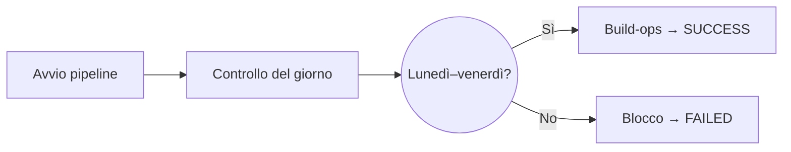

<h1 align="center">Jenkins ex Bonus 2 – Build nei giorni lavorativi</h1>

<p align="center">
  Pipeline dichiarativa con controllo del giorno tramite Groovy senza usare comandi shell.
</p>


## Obiettivo

- leggere il giorno con l'oggetto `Date` di Groovy;
- non utilizzare comandi shell per la data;
- eseguire lo stage `Build-ops` nei giorni lavorativi;
- interrompere la pipeline il sabato e la domenica.

## Flusso



## Struttura

```text
.
├── Jenkinsfile
├── traccia.txt
└── README.md
```

## Funzionamento

Groovy restituisce il giorno come numero da `1` a `7`:

```groovy
new Date().format('u').toInteger()
```

| Valore | Giorni | Stage eseguito | Risultato |
| ---: | --- | --- | --- |
| `1–5` | Lunedì–venerdì | `Build-ops` | `SUCCESS` |
| `6–7` | Sabato–domenica | `Controllo data` | `FAILED` |

## Comandi principali

Controllo del weekend:

```groovy
new Date().format('u').toInteger() >= 6
```

Blocco della pipeline:

```groovy
error 'Warning: oggi è sabato o domenica. Build bloccata'
```

Messaggio durante un giorno lavorativo:

```groovy
echo 'Giorno lavorativo: eseguo la build dev-ops'
```

> [!IMPORTANT]
> `error` interrompe la pipeline e imposta il risultato su `FAILED`. Uno stage
> indicato come `skipped`, invece, è stato semplicemente saltato dal `when`.

## Avvio della Pipeline

Per eseguire la pipeline sull'agent possiamo o incollare direttamente la pipeline nel suo apposito box dentro Jenkins oppure salvare il Jenkinsfile sulla repo Git e dentro Jenkins selezionare **"Pipeline script from SCM"**.
