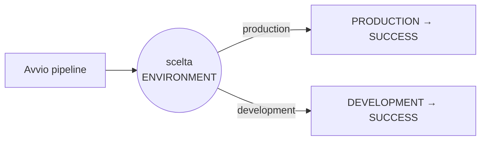

<h1 align="center">Jenkins ex Bonus 3 – Selezione dell'ambiente</h1>

<p align="center">
  Pipeline dichiarativa con parametro <code>ENVIRONMENT</code> e stage condizionali in base a scelta utente.
</p>


## Obiettivo

- creare il parametro `ENVIRONMENT`;
- permettere la scelta tra due ambienti;
- eseguire soltanto lo stage corrispondente;
- stampare nel log il valore selezionato.

## Flusso



## Struttura

```text
.
├── Jenkinsfile
├── traccia.txt
└── README.md
```

## Funzionamento

Il parametro viene mostrato da Jenkins come menu di scelta:

```groovy
choice(
    name: 'ENVIRONMENT',
    choices: ['production', 'development'],
    description: "Seleziona l'ambiente"
)
```

| Valore scelto | Stage eseguito | Stage saltato | Output |
| --- | --- | --- | --- |
| `production` | `PRODUCTION` | `DEVELOPMENT` | `production` |
| `development` | `DEVELOPMENT` | `PRODUCTION` | `development` |

## Comandi principali

Controllo dello stage `PRODUCTION`:

```groovy
params.ENVIRONMENT == 'production'
```

Controllo dello stage `DEVELOPMENT`:

```groovy
params.ENVIRONMENT == 'development'
```

Stampa del parametro:

```groovy
echo "${params.ENVIRONMENT}"
```

> [!IMPORTANT]
> Viene eseguito soltanto lo stage che soddisfa la condizione `when`. Lo stage
> indicato come `skipped` è stato correttamente saltato e non rappresenta un
> errore.


## Avvio dellam Pipeline

Per eseguire la pipeline sull'agent possiamo o incollare direttamente la pipeline nel suo apposito box dentro Jenkins oppure salvare il Jenkinsfile sulla repo Git e dentro Jenkins selezionare **"Pipeline script from SCM"**.

