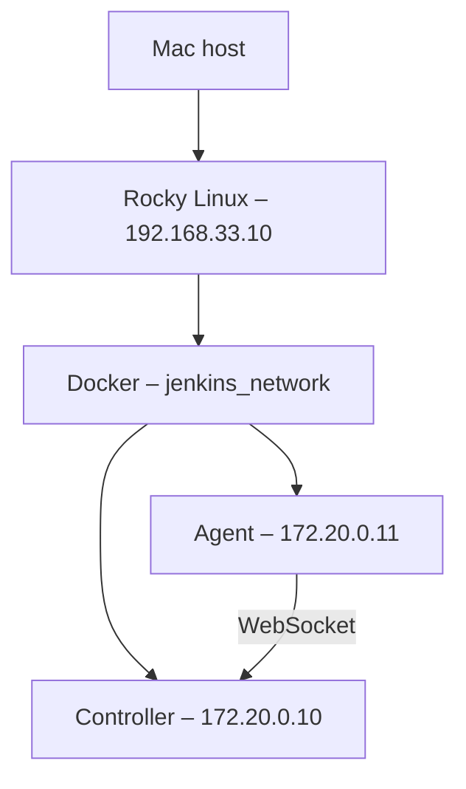

<h1 align="center">TRACK 2 – Step 1: Jenkins Controller e Agent</h1>

<p align="center">
  Laboratorio DevOps con Vagrant, Ansible, Docker e Rocky Linux 9.
</p>


## Obiettivo

- creare la VM `jenkins-lab` con Vagrant; [Vagrantfile](../Vagrantfile)
- installare Docker tramite Ansible; [Playbook con roles](./site.yml)
- creare una rete Docker dedicata; [Role rete Docker](ansible/roles/docker_network/tasks/main.yml)
- avviare controller e agent con indirizzi IP statici; [Role Agent](ansible/roles/jenkins_agent/tasks/main.yml) -- [Role Controller](ansible/roles/jenkins_controller/tasks/main.yml)
- collegare l'agent al controller tramite WebSocket.

## Architettura



## Struttura

```text
TRACK_2/
├── Vagrantfile
└── step_1_es/
    ├── site.yml
    ├── group_vars/
    │   └── all.yml
    └── ansible/
        ├── requirements.yml
        └── roles/
            ├── docker_engine/
            ├── docker_network/
            ├── jenkins_controller/
            └── jenkins_agent/
```

## Componenti

| Componente | Configurazione |
| --- | --- |
| VM | `generic/rocky9`, 2 CPU, 2 GB RAM |
| Rete host-only | `192.168.33.10` |
| Rete Docker | `jenkins_network` – `172.20.0.0/24` |
| Controller | `jenkins/jenkins:2.568.1-jdk21` – `172.20.0.10` |
| Agent | `jenkins/inbound-agent:jdk21` – `172.20.0.11` |
| Jenkins Web | `http://192.168.33.10:8080` |

Il volume `jenkins_home` conserva configurazioni e dati del controller anche
dopo il riavvio del container.

## File YAML principali

### `site.yml` – ordine di esecuzione

```yaml
- name: configurazione jenkins
  hosts: all
  become: true

  roles:
    - ansible/roles/docker_engine
    - ansible/roles/docker_network
    - ansible/roles/jenkins_controller
    - ansible/roles/jenkins_agent
```

Il playbook usa privilegi amministrativi ed esegue i ruoli in sequenza: prima
Docker, poi la rete e infine i due container Jenkins, controller e poi agent.

### `group_vars/all.yml` – variabili condivise

```yaml
jenkins_network_name: jenkins_network
jenkins_network_driver: bridge
jenkins_network_subnet: 172.20.0.0/24
jenkins_network_gateway: 172.20.0.1

jenkins_controller_ip: 172.20.0.10
jenkins_agent_ip: 172.20.0.11

jenkins_agent_secret: !vault |
  $ANSIBLE_VAULT;1.1;AES256
  ...
```

Queste variabili vengono condivise tra i ruoli. Il secret dell'agent rimane
cifrato e viene decifrato da Ansible durante il provisioning chiedendo la password con la flag --ask-vault-pass

### `ansible/requirements.yml` – collection richiesta

```yaml
collections:
  - community.docker
```

La collection fornisce i moduli `docker_network` e `docker_container`.

## Parti YAML dei singoli ruoli

### 1. Ruolo `docker_engine`

Il file `defaults/main.yml` elenca dipendenze e pacchetti Docker:

```yaml
docker_packages:
  - docker-ce
  - docker-ce-cli
  - containerd.io
  - docker-buildx-plugin
  - docker-compose-plugin

docker_dependencies:
  - dnf-plugins-core
  - python3-requests
```

Il file `tasks/main.yml` installa e avvia Docker:

```yaml
- name: aggiorno dep
  ansible.builtin.dnf:
    name: "{{ docker_dependencies }}"
    state: present

- name: scarico repository
  ansible.builtin.get_url:
    url: https://download.docker.com/linux/rhel/docker-ce.repo
    dest: /etc/yum.repos.d/docker-ce.repo
    mode: "0644"

- name: installo docker
  ansible.builtin.dnf:
    name: "{{ docker_packages }}"
    state: present

- name: faccio partire docker
  ansible.builtin.systemd_service:
    name: docker
    state: started
    enabled: true

- name: aggiungo utente vagrant a gruppo docker
  ansible.builtin.user:
    user: vagrant
    groups:
      - docker
    append: true
    state: present
```

Il ruolo prepara il repository, installa Docker, abilita il servizio al boot e
permette all'utente `vagrant` di utilizzare Docker.

### 2. Ruolo `docker_network`

Il file `defaults/main.yml` contiene questi valori predefiniti:

```yaml
nome_rete: jenkins_network
driver_rete: bridge
subnet_rete: 172.20.0.0/24
gateway_rete: 172.20.0.1
```

Il file `tasks/main.yml` crea la rete dedicata:

```yaml
- name: creo rete docker
  community.docker.docker_network:
    name: "{{ jenkins_network_name }}"
    driver: "{{ jenkins_network_driver }}"
    ipam_config:
      - subnet: "{{ jenkins_network_subnet }}"
        gateway: "{{ jenkins_network_gateway }}"
    appends: true
```

Le variabili arrivano da `group_vars/all.yml`. La rete bridge consente ai due
container di comunicare usando indirizzi IP statici.

### 3. Ruolo `jenkins_controller`

Il file `defaults/main.yml` definisce il container del controller:

```yaml
nome_container: jenkins-controller
immagine_docker: jenkins/jenkins:2.568.1-jdk21
porta_host: 8080
volume_docker: jenkins_home
restart_policy: unless-stopped
```

Il file `tasks/main.yml` crea e avvia il container:

```yaml
- name: creo container
  community.docker.docker_container:
    name: "{{ nome_container }}"
    image: "{{ immagine_docker }}"
    published_ports:
      - "{{ porta_host }}:8080"
    volumes:
      - "{{ volume_docker }}:/var/jenkins_home"
    restart_policy: "{{ restart_policy }}"
    networks:
      - name: "{{ jenkins_network_name }}"
        ipv4_address: "{{ jenkins_controller_ip }}"
    state: started
```

La porta rende disponibile l'interfaccia web, mentre il volume conserva i dati
di Jenkins anche se il container viene ricreato.

### 4. Ruolo `jenkins_agent`

Il file `defaults/main.yml` definisce immagine e collegamento al controller:

```yaml
jenkins_agent_name: jenkins-agent
jenkins_agent_immagine: jenkins/inbound-agent:jdk21
jenkins_agent_workdir: /home/jenkins/agent
jenkins_agent_URL_controller: http://172.20.0.10:8080/
jenkins_agent_restart_policy: unless-stopped
```

Il file `tasks/main.yml` configura e avvia l'agent:

```yaml
- name: configurazione jenkins-agent
  community.docker.docker_container:
    name: "{{ jenkins_agent_name }}"
    image: "{{ jenkins_agent_immagine }}"
    state: started
    networks:
      - name: "{{ jenkins_network_name }}"
        ipv4_address: "{{ jenkins_agent_ip }}"
    env:
      JENKINS_URL: "{{ jenkins_agent_URL_controller }}"
      JENKINS_SECRET: "{{ jenkins_agent_secret }}"
      JENKINS_AGENT_NAME: "{{ jenkins_agent_name }}"
      JENKINS_AGENT_WORKDIR: "{{ jenkins_agent_workdir }}"
      JENKINS_WEB_SOCKET: "true"
    restart_policy: "{{ jenkins_agent_restart_policy }}"
  no_log: true
```

Le variabili d'ambiente registrano l'agent sul controller. La connessione usa
WebSocket e `no_log: true` impedisce che il secret compaia nei log Ansible.

> [!NOTE]
> In `docker_network/defaults/main.yml` le variabili `nome_rete`, `driver_rete`,
> `subnet_rete` e `gateway_rete` non sono lette dal task, che utilizza invece le
> variabili `jenkins_network_*` definite in `group_vars/all.yml`. Il ruolo
> funziona, ma questi valori predefiniti sono attualmente superflui.

> [!IMPORTANT]
> Il secret dell'agent è cifrato con Ansible Vault. Il `Vagrantfile` richiede il
> file locale `~/.ansible/jenkins_lab_vault_pass`, che non deve essere salvato
> nel repository. Il secret deve appartenere al nodo Jenkins chiamato
> `jenkins-agent`.

## Avvio

Dalla directory del progetto:

```bash
ansible-galaxy collection install -r step_1_es/ansible/requirements.yml
chmod 600 ~/.ansible/jenkins_lab_vault_pass
vagrant up
```

Per applicare nuovamente i ruoli dopo una modifica:

```bash
vagrant provision
```

## Verifica

```bash
vagrant status
vagrant ssh
```

Dentro la VM:

```bash
docker ps
docker network inspect jenkins_network
docker logs jenkins-agent
```

Per recuperare la password iniziale del controller:

```bash
docker exec jenkins-controller \
  cat /var/jenkins_home/secrets/initialAdminPassword
```


La verifica è completata quando il controller risponde sulla porta `8080`, i
due container risultano `Up` e l'agent compare online nei nodi Jenkins.
