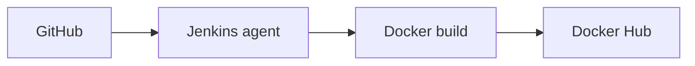

<h1 align="center">TRACK 2 – Step 2: Build e Push Docker con Jenkins</h1>

<p align="center">
  Pipeline dichiarativa per creare, taggare e pubblicare un'immagine Flask su Docker Hub.
</p>

In questo step ho realizzato una piccola applicazione Flask e una pipeline
Jenkins che costruisce l'immagine Docker, calcola il tag in base al riferimento
Git e la pubblica sul repository `tommasofranco/flask-app`.

## Obiettivo

- eseguire il checkout del repository Git;
- calcolare automaticamente il tag Docker;
- costruire l'immagine usando il `Dockerfile` dell'applicazione;
- autenticarsi su Docker Hub tramite le credenziali Jenkins;
- pubblicare l'immagine e ripulire l'agent dalle immagini locali.

## Flusso



## Struttura

```text
TRACK_2/
└── step_2/
    ├── Jenkinsfile
    └── app/
        ├── app.py
        ├── Dockerfile
        └── requirements.txt
```

## Requisiti Jenkins

| Elemento | Configurazione |
| --- | --- |
| Job | Multibranch Pipeline `flask-app-example-build` |
| Agent | Label `jenkins-agent` |
| Plugin | Docker Pipeline |
| Credenziali | ID `dockerhub-credentials` |
| Immagine | `tommasofranco/flask-app` |

L'agent deve avere il comando Docker e l'accesso a un Docker daemon, locale o
remoto. Le credenziali Docker Hub vengono gestite da Jenkins e non devono essere
scritte nel `Jenkinsfile`.

## Regole dei tag

| Riferimento Git | Tag Docker prodotto |
| --- | --- |
| Tag Git, ad esempio `v1.0.0` | `v1.0.0` |
| Branch `master` | `latest` |
| Branch `develop` | `develop-<SHA_COMMIT>` |
| Qualsiasi altro branch | Pipeline interrotta con errore |

## Parti dei file

### 1. `Jenkinsfile` – funzione di build e push

La funzione riceve i parametri della build, applica i valori predefiniti e
compone il riferimento completo `<immagine>:<tag>`.

```groovy
def buildAndPushTag(Map args) {
    def defaults = [
        registryUrl: 'https://index.docker.io/v1/',
        credentialsId: 'dockerhub-credentials',
        dockerfileDir: '.',
        dockerfileName: 'Dockerfile',
        buildArgs: '',
        pushLatest: true
    ]

    args = defaults + args
    def imageRef = "${args.image}:${args.buildTag}"
```

`docker.withRegistry` effettua l'accesso a Docker Hub usando le credenziali
Jenkins. `docker.build` costruisce l'immagine e `image.push()` la pubblica.

```groovy
docker.withRegistry(args.registryUrl, args.credentialsId) {
    def image = docker.build(
        imageRef,
        "${args.buildArgs} -f ${args.dockerfileName} ${args.dockerfileDir}".trim()
    )

    image.push()

    if (args.pushLatest && args.buildTag != 'latest') {
        image.push('latest')
        sh "docker rmi --force ${args.image}:latest"
    }

    sh "docker rmi --force ${imageRef}"
}
```

I comandi `docker rmi` eliminano le immagini locali dopo il push, evitando di
riempire il disco dell'agent Jenkins.

### 2. `Jenkinsfile` – configurazione della pipeline

```groovy
pipeline {
    agent { label 'jenkins-agent' }

    options {
        skipDefaultCheckout(true)
    }

    environment {
        IMAGE_NAME = 'tommasofranco/flask-app'
    }
```

`skipDefaultCheckout(true)` evita il checkout automatico; il repository viene
scaricato una sola volta nello stage dedicato.

```groovy
stage('Checkout') {
    steps {
        checkout scm
    }
}
```

### 3. `Jenkinsfile` – calcolo del tag

```groovy
stage('Calcola tag') {
    steps {
        script {
            if (env.TAG_NAME) {
                env.IMAGE_TAG = env.TAG_NAME
            } else if (env.BRANCH_NAME == 'master') {
                env.IMAGE_TAG = 'latest'
            } else if (env.BRANCH_NAME == 'develop') {
                def gitSha = sh(
                    script: 'git rev-parse HEAD',
                    returnStdout: true
                ).trim()

                env.IMAGE_TAG = "develop-${gitSha}"
            } else {
                error("Branch non supportato: ${env.BRANCH_NAME}")
            }
        }
    }
}
```

La condizione controlla prima un eventuale tag Git, poi i branch `master` e
`develop`. Per `develop` viene usato lo SHA completo del commit.

### 4. `Jenkinsfile` – build e pubblicazione

```groovy
stage('Build e push') {
    steps {
        dir('TRACK_2/step_2/app') {
            script {
                def result = buildAndPushTag(
                    image: env.IMAGE_NAME,
                    buildTag: env.IMAGE_TAG,
                    pushLatest: (env.BRANCH_NAME == 'master')
                )

                echo "Immagine pubblicata: ${result}"
            }
        }
    }
}
```

`dir` imposta come contesto di build la cartella dell'app. Il tag `latest`
viene associato solo alle build del branch `master`.

### 5. `Dockerfile` – costruzione dell'immagine

```dockerfile
FROM python:3.10-alpine

WORKDIR /app
COPY requirements.txt /app
RUN pip install --no-cache-dir -r requirements.txt
COPY app.py .
CMD ["python3", "app.py"]
```

L'immagine parte da Python Alpine, installa Flask e avvia `app.py`. La copia di
`requirements.txt` avviene prima del codice per sfruttare la cache dei layer
Docker quando cambiano solo i file dell'applicazione.

### 6. `app.py` – applicazione Flask

```python
from flask import Flask

app = Flask(__name__)


@app.route("/")
def hello():
    return "hello world"


if __name__ == "__main__":
    app.run(host="0.0.0.0", port=8000)
```

La route `/` restituisce `hello world`. L'indirizzo `0.0.0.0` permette di
raggiungere Flask dall'esterno del container sulla porta `8000`.

### 7. `requirements.txt` – dipendenze Python

```text
flask
```

Il file viene letto da `pip` durante la build e installa Flask nell'immagine.

## Comandi principali

Test locale dell'immagine:

```bash
docker build -t tommasofranco/flask-app:test TRACK_2/step_2/app
docker run --rm -p 8000:8000 tommasofranco/flask-app:test
curl http://localhost:8000
```

Esempi di riferimenti Git che attivano le diverse regole:

```bash
git push origin master
git push origin develop
git tag v1.0.0
git push origin v1.0.0
```

## Controllo dei file

La soluzione rispetta la traccia e non presenta errori bloccanti. Prima della
build è necessario verificare che Jenkins rilevi branch e tag tramite un job
Multibranch Pipeline e che l'agent possa eseguire Docker.

> [!NOTE]
> Nel `Dockerfile` si può aggiungere `EXPOSE 8000` per documentare la porta usata
> dall'applicazione. Non è obbligatorio per il funzionamento del container.

> [!TIP]
> In un progetto destinato alla produzione è preferibile indicare una versione
> precisa di Flask in `requirements.txt`, così le build risultano riproducibili.

La verifica è completata quando Jenkins termina con stato `SUCCESS`, l'immagine
compare su Docker Hub con il tag previsto e la route `/` restituisce
`hello world`.
